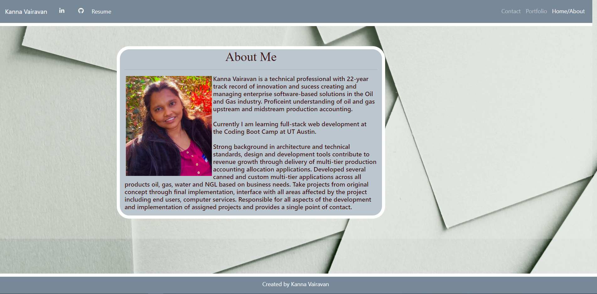

# **Portfolio**

## _Description_

_This application includes responsive layout using Bootstrap gird system (containers, rows, and columns).  
I have also used Bootstrap sub-columns & sticky footer.
I have created three html pages (index.html, portfolio.html and contact.html).
responsive navbar will be a togglebar for small screens.
All images used in this application are resposive with the help of Bootstrap classes.
This application is following the structure of semantic HTML elements._

## _About Me_

### 

## _Portfolio_

### 

## _Contact_

### 

## _Link_

https://kannavairavan.github.io/Portfolio/index.html

## _Repository_

https://github.com/KannaVairavan/Portfolio.git

### Technologies

Visual Studio code, HTML5, Bootstrap and CSS
